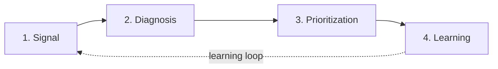

# GIOS — Growth Intelligence Operating System

A portfolio project that shows how a growth team can turn scattered signals (customer voice,
web behavior, funnel and revenue data, sales feedback, past experiments) into a diagnosis,
a prioritized roadmap, and reusable learning.

The data is synthetic. It describes **EchoAI**, a fictional B2B SaaS company that sells AI
meeting transcription.

## How it works

GIOS has four layers. The learning layer feeds back into the signal layer:



1. **Signal**: collect and classify evidence (observed / inferred / unknown)
2. **Diagnosis**: find where value leaks and why
3. **Prioritization**: score opportunities with GROWTH and validate hypotheses
4. **Learning**: measure downstream impact and capture what was learned

Design rule: all math, scoring and statistics are deterministic, tested Python. The LLM only
tags qualitative evidence and writes narrative.

## Modules

Each module has a spec in [`specs/`](specs/).

| Module | Layer | Status |
|---|---|---|
| Growth Intelligence Diagnostic | Diagnosis | Ready |
| Customer Signal Synthesizer | Signal | Ready |
| Behavioral Friction Analyzer | Signal | Ready |
| Qualified Demand Leakage Auditor | Diagnosis | Ready |
| Hypothesis Evidence Validator | Diagnosis | Ready |
| Experiment Opportunity Scorer | Prioritization | Ready |
| Growth Priority Orchestrator | Prioritization | Ready |
| Downstream Impact Analyzer | Learning | Ready |
| Experiment Learning Capture | Learning | Ready |
| Growth Council Insight Brief | Learning | Ready |

## Quickstart

```bash
pip install -r requirements.txt
python scripts/generate_data.py   # writes data/synthetic/*.csv (seeded)
streamlit run app.py
python -m pytest -q
```

If `ANTHROPIC_API_KEY` is not set (see `.env.example`), GIOS runs in **demo mode** and uses
the cached LLM outputs in `demo/`. Rebuild them with `python scripts/build_demo_cache.py`.
The shipped cache holds reference annotations authored offline for the synthetic data. Run
`python scripts/build_demo_cache.py --live` with a key set to regenerate it from the model.

## Stack

Python 3.11, Streamlit, Pydantic v2, pandas, SciPy, Plotly, Anthropic SDK, SQLite, pytest.
