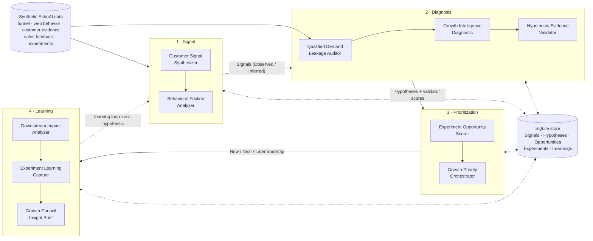

# GIOS: Growth Intelligence Operating System

GIOS turns scattered growth signals into a diagnosis, a prioritized roadmap, and reusable
learning. The math is deterministic and tested; the LLM tags qualitative evidence and writes the
narrative.

It runs on synthetic data for **EchoAI**, a fictional B2B SaaS company that sells AI meeting
transcription.

## The problem

Growth teams rarely lack data. They lack a shared way to connect it. Customer interviews sit in
one tool, web analytics in another, funnel and revenue data in the CRM, and experiment results in
slide decks. Each team sees part of the problem, so the loudest anecdote or the biggest top-funnel
lift wins the roadmap. A frequent complaint gets mistaken for an important one, a conversion lift
turns out to bring worse leads, and the same failed experiment runs again a year later.

## The solution

GIOS is a four-layer system. Each layer is a set of modules with a written spec ([`specs/`](specs/)),
and modules pass structured, evidence-linked records to each other through a shared store:

1. **Signal**: collect evidence and label it Observed, Inferred or Unknown.
2. **Diagnosis**: find where value leaks and why, and check that hypotheses are grounded.
3. **Prioritization**: score opportunities and balance them into a Now / Next / Later roadmap.
4. **Learning**: measure downstream impact, capture what was learned, and brief the growth council.

The learning layer feeds the next round of signals.

**Run Full Diagnostic** runs Signal → Diagnosis → Validation → Scoring → Orchestration in one
click. On the synthetic data it surfaces the three problems hidden in it:

- unclear pricing losing paid search evaluators
- webinar leads that are learners, not buyers
- a broken mobile demo form

It also keeps the most frequent but low-severity complaint (dark mode and other cosmetic requests)
off the roadmap.

## Architecture



Inside each module the flow is the same: deterministic Python computes every number, the LLM
(through one wrapper, `gios/core/llm.py`) returns JSON validated against a Pydantic model, and
code checks the result before it reaches a page or the store.

## Modules

| Module | Layer | Purpose | Deterministic (code) | LLM |
|---|---|---|---|---|
| Customer Signal Synthesizer | Signal | Structured themes from customer evidence without overstating frequency | Frequency counted and binned, trend, ranking by F×S×C×J | Tags each verbatim; proposes severity and relevance (editable) |
| Behavioral Friction Analyzer | Signal | Where behavior shows confusion or abandonment | Mix-standardized anomaly tests, load and trend checks, funnel sizing, customer-evidence check | Friction type, competing explanations, validation needed |
| Qualified Demand Leakage Auditor | Diagnosis | Where qualified demand is lost | Stage map with Wilson CIs, benchmarks, flags, gap sizing, owner classes | Narrative only |
| Growth Intelligence Diagnostic | Diagnosis | The most important growth problem and next action | Step 1 gate, leakage point, ranking, confidence | Root-cause hypotheses citing signal ids (unknown ids rejected) |
| Hypothesis Evidence Validator | Diagnosis | Keep assumption-led tests off the roadmap | Six-part check, evidence caps, total, band, recommendation | Proposes 0–2 scores with justifications (overridable) |
| Experiment Opportunity Scorer | Prioritization | GROWTH prioritization | Prefills, priority score, sample-size check, recommendation rules | None |
| Growth Priority Orchestrator | Prioritization | A balanced Now / Next / Later roadmap | Merges, buckets, horizons, portfolio balance | Proposes duplicate clusters and dependency tags |
| Downstream Impact Analyzer | Learning | Did a win improve business quality? | Stage-by-stage tests, power, velocity window, segments, interpretation | None |
| Experiment Learning Capture | Learning | Reusable knowledge from every experiment | Statistical result, segment findings, library search | Drafts each section and the next hypothesis |
| Growth Council Insight Brief | Learning | A cross-functional decision brief | Period gathering, numbers, owner suggestions, Slack summary | Writes the ten sections, citing only records in scope |

Each module page has a **How this module works** expander that links its spec.

## Design principles

- **Deterministic math.** Every rate, test, confidence interval, score, threshold and ranking is
  plain Python with tests. The LLM never computes a number. LLM prose is validated to contain no
  quantities, and the app renders the computed values next to it.
- **Evidence-linked claims.** Every observation is labeled Observed, Inferred or Unknown. LLM
  claims must cite a stored record id; outputs that cite ids that do not exist are rejected after
  one retry. Causes stay "unconfirmed" until customer evidence supports them.
- **Judgment over scores.** Scores and rules produce defaults, not verdicts. LLM-proposed scores
  are capped by what the evidence supports and are editable; recommendations can be overridden
  with a written reason; merges and owners are confirmed by a person.
- **Specs are the source of truth.** Each module renders its spec's output format exactly and
  exports it as Markdown.

## Synthetic data

All data is synthetic and generated by [`scripts/generate_data.py`](scripts/generate_data.py) with
a fixed seed (2026-03 to 2026-08). EchoAI is fictional; no real company, customer or personal data
is used. The generator embeds three stories and one red herring. They are clear enough to find but
not cartoonish, and nothing in the data proves causation. Tests check the stories and the noise
across 60 seeds.

1. **Paid search → pricing page.** Paid search is about a quarter of traffic. Its pricing-page
   exit rate climbs from about 47% to 69% while other sources stay near 40%, with a flat July.
   Paid search CAC rises about 64% between the two halves of the period. Pricing-clarity
   verbatims from high-intent stages grow, with one dip, from 6 to 34 a month. They cover unclear
   structure, what is included, which plan fits, and having to talk to sales before seeing a cost.
2. **Webinar qualification mismatch.** Webinars bring the most leads and the best Lead→MQL rate,
   but only about 13% of webinar MQLs become SQLs, against roughly 42% elsewhere. Once
   accepted, webinar SQLs progress like any other source and still produce real wins. Sales
   rejections cite low intent, educational interest only, company too small, not in market,
   and student or research use. Follow-up speed is normal.
3. **Mobile demo form.** Mobile visitors start the demo form more often than desktop visitors
   but complete it far less often. They also exit more, rage-click more, and load the page in
   about 4.8 s against 1.4 s. Other pages show only the normal mobile gap.
4. **Red herring.** Dark-mode and cosmetic requests are the most frequent customer theme, from
   onboarding and retention feedback only, flat over time, and unrelated to funnel movement.

Realistic noise keeps the modules honest:
- **Traffic:** month-to-month shocks, named event months (an April press mention, a May flagship
  webinar, a paused June paid social campaign, a strong July for paid search), and drift in the
  source mix (paid social growing, email shrinking).
- **Segments:** mid-market qualifies more often and is followed up faster than SMB.
- **Sources:** email converts visits to leads well but is ordinary downstream.
- **Devices:** a normal mobile gap in exits and load time on every page.
- **Experiments:** an outlier with a huge lift on a tiny, two-week sample that has not matured.

## Screenshots

<!-- Replace these placeholders with real captures before publishing. -->
| | |
|---|---|
|  |  |
| _Run Full Diagnostic: story checks and Executive Growth Priorities_ | _Diagnostic: evidence badges and ranked root causes_ |
|  |  |
| _Scorer: GROWTH scores on a log scale_ | _Downstream impact: lift with 95% CIs at every stage_ |

## How to run

```bash
python3.11 -m venv .venv && source .venv/bin/activate
pip install -r requirements-dev.txt
streamlit run app.py          # opens the app; start with "Run Full Diagnostic"
python -m pytest -q           # the full suite
```

The synthetic data and demo cache are committed, so the app works immediately. To rebuild them:

```bash
python scripts/generate_data.py        # data/synthetic/*.csv (seeded)
python scripts/build_demo_cache.py     # demo/*.json (offline reference outputs)
```

By default every browser session gets its own workspace, so visitors to a public deployment never
see each other's work. To keep one persistent workspace locally, set `GIOS_STORE_MODE=shared`
(it writes `gios.db`).

### Deploying to Streamlit Community Cloud

Main file `app.py`, Python 3.11 (advanced settings). `requirements.txt` is pinned. No secrets are
needed: without a key the app runs in demo mode.

## Running with an API key

Copy `.env.example` to `.env` and set `ANTHROPIC_API_KEY` (or add it to Streamlit secrets as an
environment variable). With a key, every LLM step calls Claude (`claude-sonnet-5-5`, configurable
with `GIOS_MODEL`) and works for any scope, period or edited input. Without one, GIOS runs in
**demo mode** and serves the cached outputs in [`demo/`](demo/). To refresh the cache from the
live model:

```bash
ANTHROPIC_API_KEY=... python scripts/build_demo_cache.py --live
```

If the API is unreachable, pages degrade: every computed number still renders and the narrative
shows why it is missing.

## Tech

Python 3.11 · Streamlit (multipage with `st.navigation`) · Pydantic v2 · pandas · NumPy · SciPy ·
Plotly · Anthropic Python SDK · SQLite (stdlib) · pytest (unit, integration and Streamlit AppTest
page tests).

## Limitations

- **Synthetic data only.** The stories are designed in; real data is noisier, sparser and
  messier to join.
- **Demo mode covers the default paths.** Cached LLM outputs exist for the default scopes:
  diagnoses for all channels, paid search and webinar, and the brief for the full period. Other
  scopes, periods or edited inputs need an API key. The shipped cache holds reference outputs
  written offline for the synthetic data; `--live` replaces them with model output.
- **Statistics are deliberately simple.** Normal-approximation two-proportion tests, unpooled
  Wald intervals and a single significance level. There is no sequential testing, multiple-
  comparison correction across the anomaly scan, or Bayesian alternative. Revenue per visitor
  intervals assume equal deal size across arms.
- **Sizing uses explicit assumptions.** Funnel sizing propagates through current downstream rates
  and is an upper bound.
- **Single-user workspaces.** The SQLite store is per session or per machine; there is no
  authentication or multi-user collaboration.

## Future improvements

- **Warehouse / SQL source**: read funnel, behavior and revenue tables from Snowflake, BigQuery or
  Postgres instead of CSVs.
- **GA4 connector**: pull page, source and device behavior directly for the friction analyzer.
- **CRM sync**: read MQL/SQL stages, rejection reasons and follow-up times from Salesforce or
  HubSpot, and write approved roadmap items back as tasks.
- **Slack alerts**: post the Growth Council summary on a schedule and alert when a flag or story
  check changes.
- Deal-level revenue data for exact revenue-per-visitor intervals, and sequential testing for
  experiments read mid-flight.
